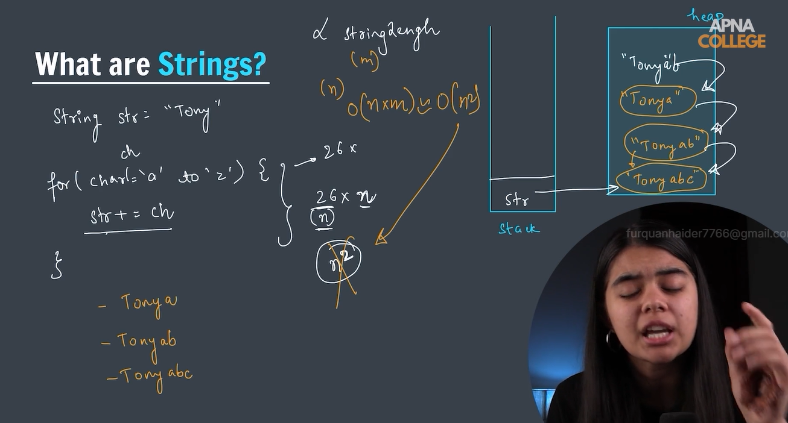
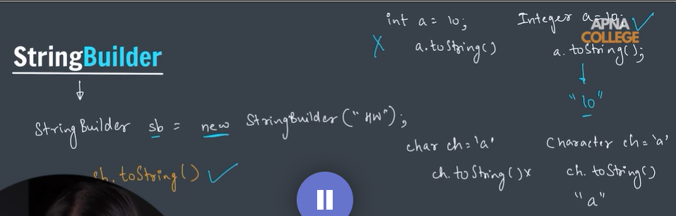
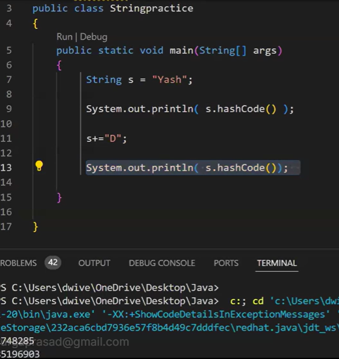
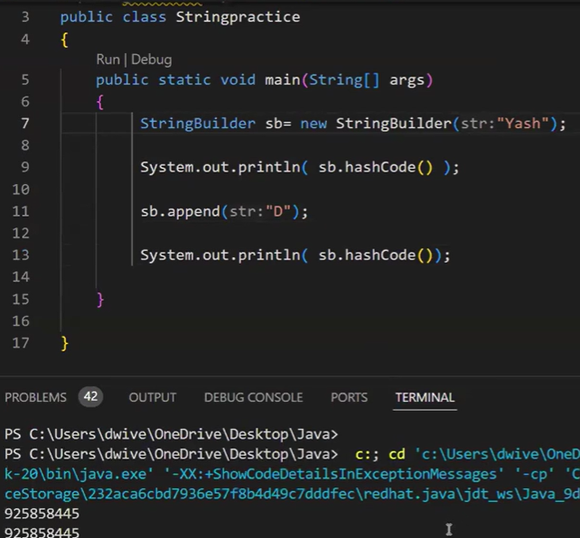
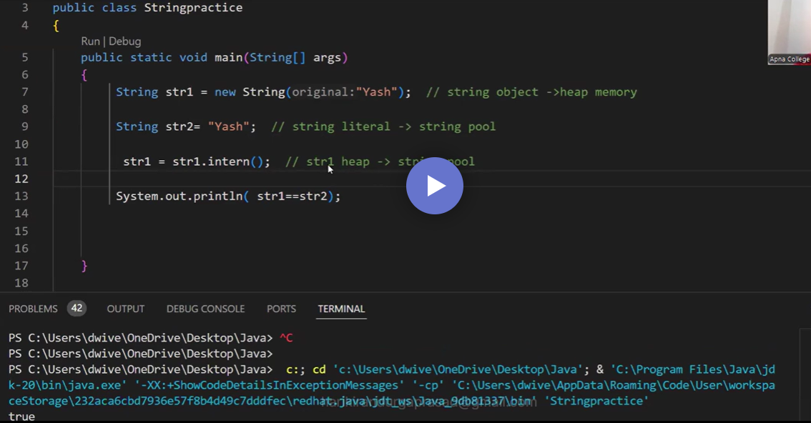

## why we use String Builder instead of string in java

This looks like the look should go 26 times but it goes 26*n(where n is the size of the character like here tony)

Copy garne ∝ String length (m), 
similarily if we have a loop of n the tc O(m*n) ie. O(n^2)

String Buffer- hashcode-is an integer value that represents on object's unique identity. 
ie. uniquely identify an obj

why string are immutable in java showing using hashcode

# StringBuilder

intern function use
when you use new it creates a new obj in heap memory 
whereas if you normally declare then its called literal and is stored in string pool
