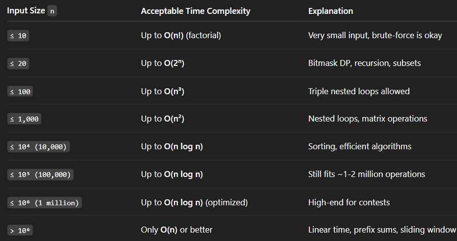

Optimization Tools to Reduce Complexity

HashMap / HashSet: Reduces lookups to O(1)

Two Pointers / Sliding Window: Simulates nested loops in O(n)

Binary Search: Reduces from O(n) to O(log n)

Monotonic Stack / Queue: For range-based or greedy solutions in O(n)

Heap / Priority Queue: Useful in O(n log n) sorting and top-k problems

Prefix Sum / Difference Array: Enables O(1) range queries

Bitmasking: Powerful for 2^n subset solutions

📌 Tips
If n is small (≤ 20), recursion/backtracking is fine.

If n is around 10^5, avoid O(n^2) — it's too slow.

If n is near 10^9, only O(log n) or O(1) will work — think binary search or mathematical tricks.

Always check for optimizations before finalizing brute-force.

