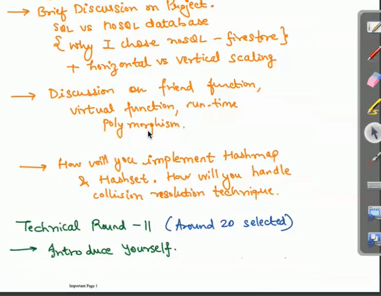

# Archit Aggarwal

coding round is asked in hackerrank/hacker-run

service based companies- debuging based program, mathematics, relational algebra/maths. 

mcq mostly asked in os, dbms, oops, computer networking 

Technical round -1
1. Introduce yourself: 2 min, 
2. 2 pointer technique 
splitwise: dsa was used in this, why you use this concept

3. abstract classes, interfaces, runtime polymorphism
4. what is your favorite subject: say technical subjects. eg oops, oops related qn is asked. multiple inheritance implement it: 
5. 

# REVISE 
willianfist How to start leetcode:

time and space complexity Basic
sorting searching recursion,
fundamental array, strings binary tree linked list stacks queues hash map

use topics,

difficuly level backend>frontend faang>startup

for senior roles: experience and system design >leetcode

top interview 150 top 100 liked

what, how, why?

Brute force approach
optimising/ plan and approach
time and complexity- edges

qn->hints->solution videos extension if you cannot solve mark it as important

memorising is not good,

leetcode timer extension , leetcode contest. premium: premium qn, company, visual solution.

*** top 100 liked qn peek at the solution revisit the problem solve company specific problems

don't write very very decorative notes try to make your notes in code witht comments

1. go to the interviews
2.

# NOTES MAKING (common library)
1. Your own notes,

# when to make notes
1. variable, if else, loop function donot make notes but practice

2. New data structure 
a. definition. 
b. operation. 
c. Sampe code. 
d. implementation

3. algorithm / classical questions: 
# tips and tricks 
# why the avg is O(n2) qucik sort 

# do the notes in notebook 

# HOW TO MAKE NOTES
# Logic, formulat, diagrams, pseudocode, special notes

# write the function note the whole code or pseudocode

# mention time and space complexity 
#
 

 
