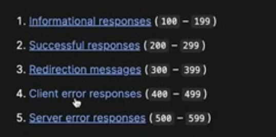

api nothing but end points

{"type":"invalid_request_error","message":"Endpoint not found: GET /v1/ai_energy/calculate. Please check the API documentation for valid endpoints."}
this above is bascially array 

sending or receving is fetching 

status : 200 ie. successful response
 

 there are different type of http request 

 generally fetch api is used for GET request 
 GET- the get method requests a reperestnation of the speciffed resource. Request using GET should only retrieve data. 
 -> 
 -> like when your request is in correct you will get error status code: 400

 bad request 
 404 page not found 

 200 -> to successful 

header will give you additional information 
 

 HOMEWORK TASK 
  sending post request 
  fetch (url, options)