# React Notes

## 1. What is Rendering?

Rendering is the process where the computer uses instructions to generate output (a webpage) on the screen.


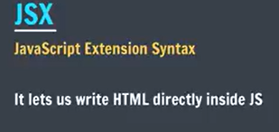


---

## 2. Project Structure

| Folder / File   | Purpose                          |
| --------------- | -------------------------------- |
| `node_modules/` | Installed npm dependencies       |
| `public/`       | SVG image of Vite                |
| `src/`          | Main application source code     |
| `src/assets/`   | SVG image of React               |

---

## 3. The Complete Flow

Example setup:

**index.html**
```html
<div id="root"></div>
```

**main.jsx**
```jsx
createRoot(document.getElementById("root")).render(<App />);
```

**App.jsx**
```jsx
function App() {
  return (
    <div>
      <h1>Hello World</h1>
      <Title />
    </div>
  );
}
```

The flow:

```text
        index.html
            │
            ▼
    <div id="root"></div>
            │
            │  main.jsx finds #root
            ▼
       React starts
            │
            │  render(<App />)
            ▼
          App
            │
            ├── <h1>Hello World</h1>
            │
            └── <Title />
                    │
                    ▼
                  Title
```

---

## 4. Main Files

- **3 main files:** `index.html`, `main.jsx` and `App.jsx`
- `App.css` → styling for `App`
- `index.css` → styling for `index.html`
- All changes are done in `App.jsx`


---

## 5. Components

- The `Title` function will have its own `.jsx` file.
- Component names **must start with an uppercase letter**.

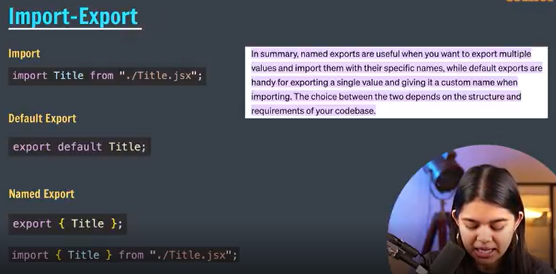

---

## 6. JSX Rules

1. **Return a single root element.** To return multiple elements from a component, wrap them in a single parent tag like `<div>`.
2. **Close all tags**, e.g. ``.
3. **Use camelCase** for most things (attributes, properties).
   - Capital first letter for naming components.
   - Cannot use reserved keywords.

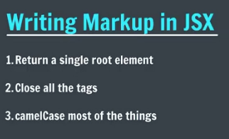

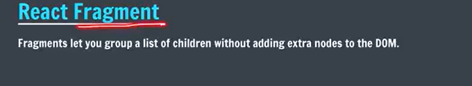

Fragment (wrapper without an extra DOM element):

```jsx
<></>
```

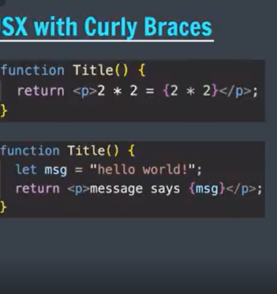

- JSX with curly braces `{}` lets us write pure JavaScript.


> Industry standard: each component file has its own separate CSS file.

---

## 7. Props


- `"3000"` → string
- `{3000}` → number

**Default values:**

```jsx
function Product({ title, price = 1 }) {
  // if price is not passed, the default price will be 1
}
```

---

## 8. Rendering Arrays Using `.map()`

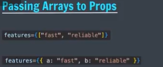

### What is `.map()`?

`.map()` is a JavaScript array method which goes through every item and create a new result.

### Basic Syntax

```js
array.map((item) => {
  return something;
});
```

In React, we commonly use it to create JSX elements:

```jsx
array.map((item) => (
  <li>{item}</li>
));
```

### Example

```jsx
let features = ["hi-tech", "durable", "fast"];

features.map((feature) => (
  <li key={feature}>{feature}</li>
));
```

`.map()` runs for every item:

```text
"hi-tech"  →  <li>hi-tech</li>
"durable"  →  <li>durable</li>
"fast"     →  <li>fast</li>
```

> Each item in a list needs a unique `key` prop.

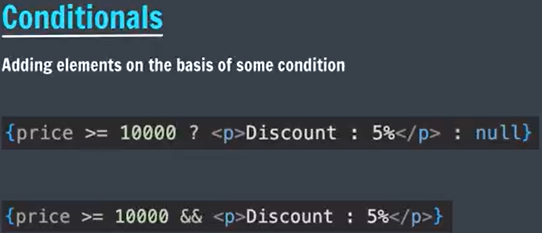

---

## 9. Styling

- Use **camelCase** for style properties: `backgroundColor`

### Dynamic Styling of Components

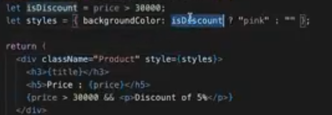
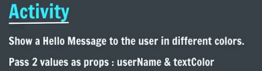 

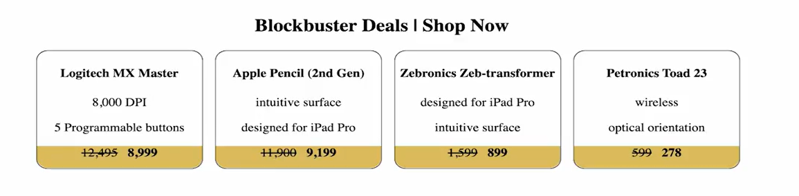
&nbsp-non breaking space 
--------------------------------------
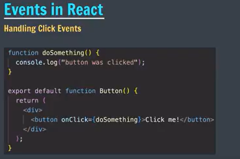
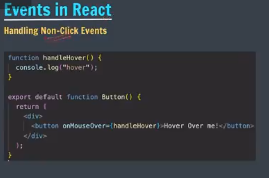
onClick-click
onMouseOver-hover
onDoubleClick-dblclick

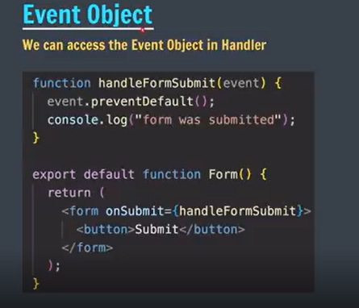
for forms prevent default behavior of refreshing pauses the screen for once, form automatically refresh the console window
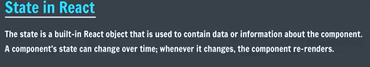 <br>

component-> function->renders

doesn't re renders the ui part. dom doesn't change 
For example:

Like button: liked or not liked.

Counter: current count.

Shopping cart: number of items.

Toggle button: on or off.

# props in react are immutable
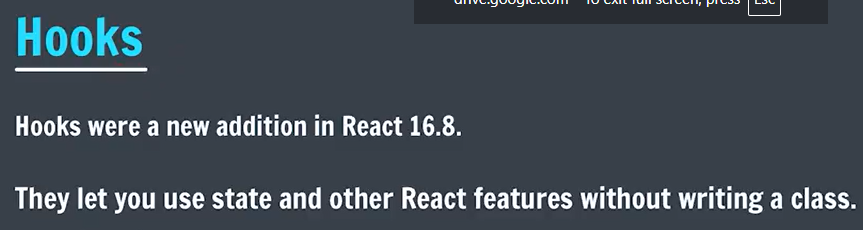 <br>
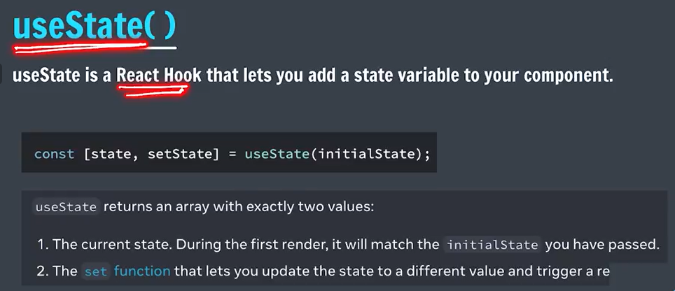
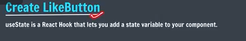
font awesome cdn-> copy the link -> include in the index.html
font awesome icons-> 

## now we want to make changes in the variable 
change heart icon
whenever there is an event we will need to make use of state variable
toggle- true or change to false viceversa 
hook can only be called inside the component inside the function component 
<br>
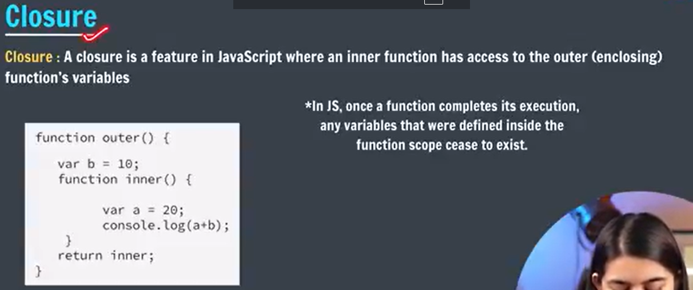
A closure happens when an inner function remembers variables from its outer scope, even after the outer function has finished executing.

function outer() {
    let count = 10;

    function inner() {
        console.log(count);
    }

    return inner;
}

const result = outer();

result(); // 10

 <br>
1. new state value depends on old state -> callbacks
2. new value doesn't depend on old state -> setCount(25)
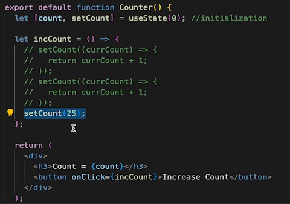

# imp points 
1. Re renders only if state value change
2. Parameter should be passed as reference not as frunction ( cause it will be executed even if not used ) 
<br>
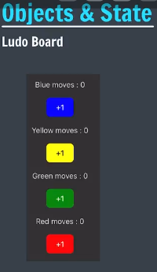

# Objects as state variable
Objects  even if we change the key's value, objects reference doesn't changes in js
objects ->spread-> object copy(new address)->updation
Arrays value changes but original address remains same 

# Arrays as state variabble