# React Notes

## 1. What is Rendering?

Rendering is the process where the computer uses instructions to generate output (a webpage) on the screen.

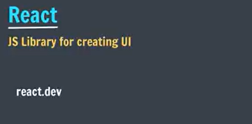
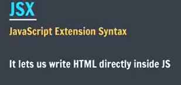


---

## 2. Project Structure

| Folder / File   | Purpose                          |
| --------------- | -------------------------------- |
| `node_modules/` | Installed npm dependencies       |
| `public/`       | SVG image of Vite                |
| `src/`          | Main application source code     |
| `src/assets/`   | SVG image of React               |

---

## 3. The Complete Flow

Example setup:

**index.html**
```html
<div id="root"></div>
```

**main.jsx**
```jsx
createRoot(document.getElementById("root")).render(<App />);
```

**App.jsx**
```jsx
function App() {
  return (
    <div>
      <h1>Hello World</h1>
      <Title />
    </div>
  );
}
```

The flow:

```text
        index.html
            │
            ▼
    <div id="root"></div>
            │
            │  main.jsx finds #root
            ▼
       React starts
            │
            │  render(<App />)
            ▼
          App
            │
            ├── <h1>Hello World</h1>
            │
            └── <Title />
                    │
                    ▼
                  Title
```

---

## 4. Main Files

- **3 main files:** `index.html`, `main.jsx` and `App.jsx`
- `App.css` → styling for `App`
- `index.css` → styling for `index.html`
- All changes are done in `App.jsx`

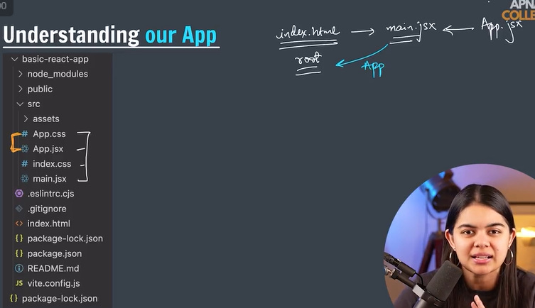
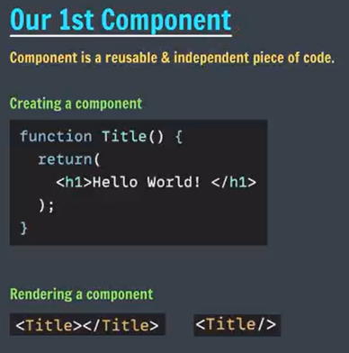

---

## 5. Components

- The `Title` function will have its own `.jsx` file.
- Component names **must start with an uppercase letter**.

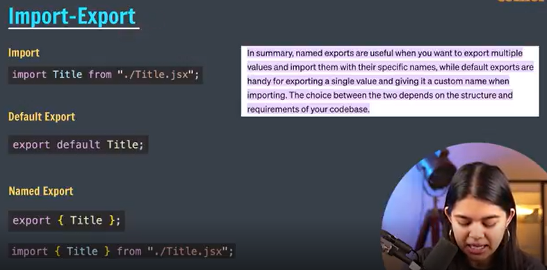

---

## 6. JSX Rules

1. **Return a single root element.** To return multiple elements from a component, wrap them in a single parent tag like `<div>`.
2. **Close all tags**, e.g. ``.
3. **Use camelCase** for most things (attributes, properties).
   - Capital first letter for naming components.
   - Cannot use reserved keywords.

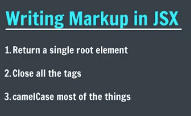

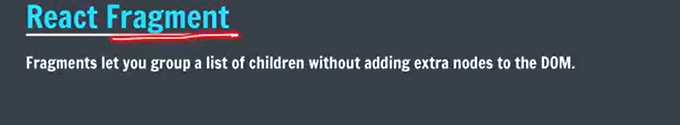

Fragment (wrapper without an extra DOM element):

```jsx
<></>
```

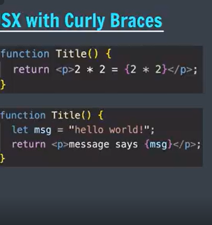

- JSX with curly braces `{}` lets us write pure JavaScript.

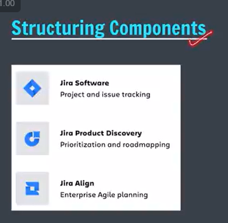
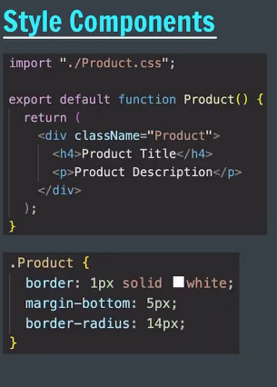

> Industry standard: each component file has its own separate CSS file.

---

## 7. Props

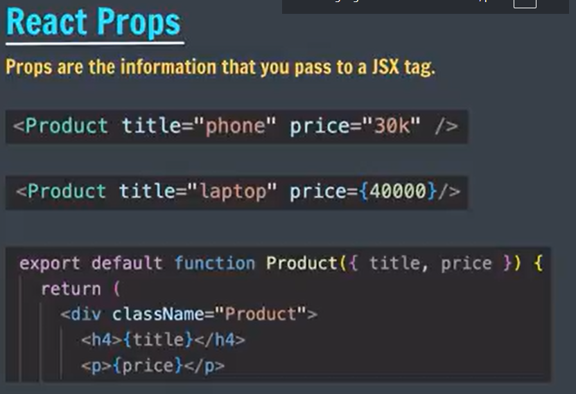

- `"3000"` → string
- `{3000}` → number

**Default values:**

```jsx
function Product({ title, price = 1 }) {
  // if price is not passed, the default price will be 1
}
```

---

## 8. Rendering Arrays Using `.map()`

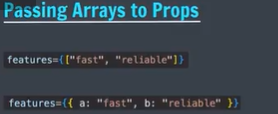

### What is `.map()`?

`.map()` is a JavaScript array method which goes through every item and create a new result.

### Basic Syntax

```js
array.map((item) => {
  return something;
});
```

In React, we commonly use it to create JSX elements:

```jsx
array.map((item) => (
  <li>{item}</li>
));
```

### Example

```jsx
let features = ["hi-tech", "durable", "fast"];

features.map((feature) => (
  <li key={feature}>{feature}</li>
));
```

`.map()` runs for every item:

```text
"hi-tech"  →  <li>hi-tech</li>
"durable"  →  <li>durable</li>
"fast"     →  <li>fast</li>
```

> Each item in a list needs a unique `key` prop.

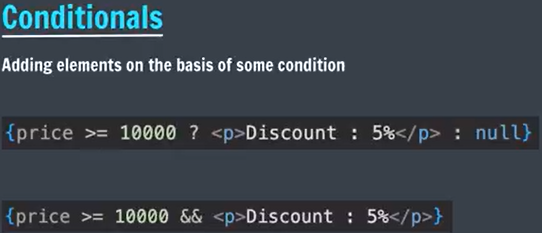

---

## 9. Styling

- Use **camelCase** for style properties: `backgroundColor`

### Dynamic Styling of Components

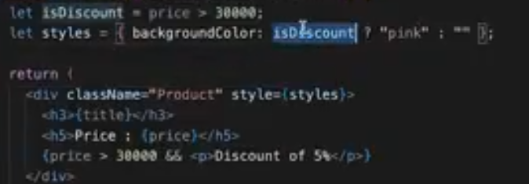
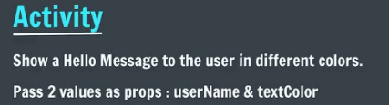 


&nbsp-non breaking space 
--------------------------------------
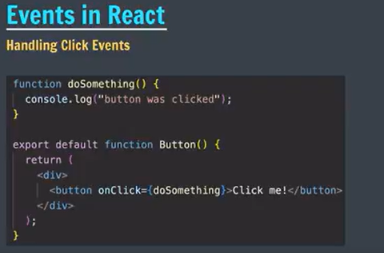
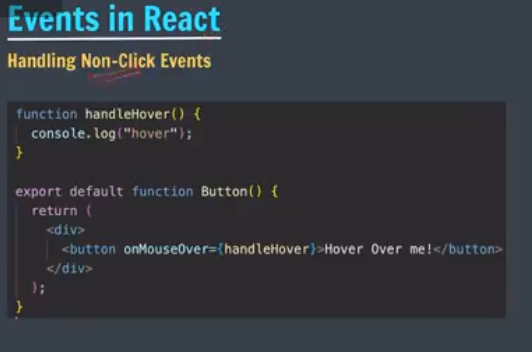
onClick-click
onMouseOver-hover
onDoubleClick-dblclick

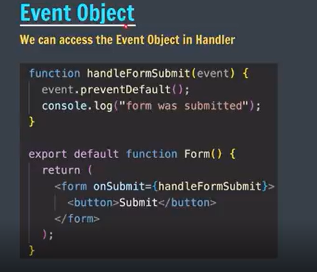
for forms prevent default behavior of refreshing pauses the screen for once, form automatically refresh the console window
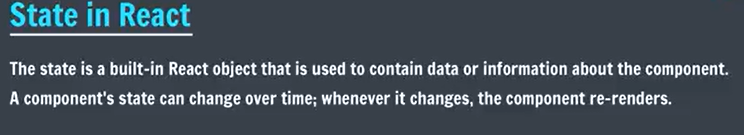 <br>

component-> function->renders

doesn't re renders the ui part. dom doesn't change 
For example:

Like button: liked or not liked.

Counter: current count.

Shopping cart: number of items.

Toggle button: on or off.

# props in react are immutable
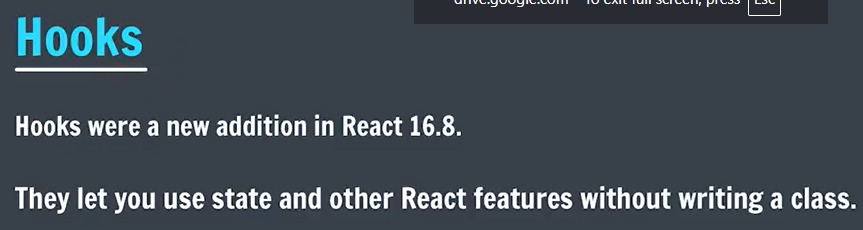 <br>
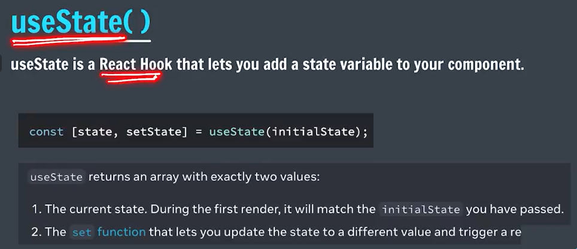
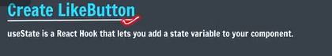
font awesome cdn-> copy the link -> include in the index.html
font awesome icons-> 

## now we want to make changes in the variable 
change heart icon
whenever there is an event we will need to make use of state variable
toggle- true or change to false viceversa 
hook can only be called inside the component inside the function component 
<br>
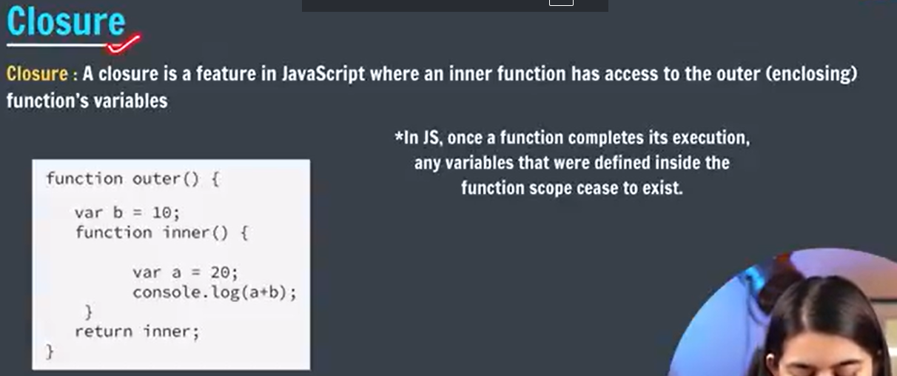
A closure happens when an inner function remembers variables from its outer scope, even after the outer function has finished executing.

function outer() {
    let count = 10;

    function inner() {
        console.log(count);
    }

    return inner;
}

const result = outer();

result(); // 10

 <br>
1. new state value depends on old state -> callbacks
2. new value doesn't depend on old state -> setCount(25)
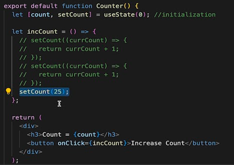

# imp points 
1. Re renders only if state value change
2. Parameter should be passed as reference not as frunction ( cause it will be executed even if not used ) 
<br>
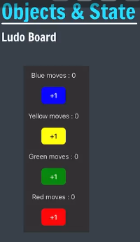

# Objects as state variable
Objects  even if we change the key's value, objects reference doesn't changes in js
objects ->spread-> object copy(new address)->updation
Arrays value changes but original address remains same 

# Arrays as state variabble

# imp points 
if new state value depends on old state-> callbacks 
if new value doesn't depend on old values setCount(35)
# rerender- only if state value changes 
parameter / should be passed as reference not as a function 
for eg. let [count, setCount]= useState(int())
int() will always be executed even if not called, so used init 

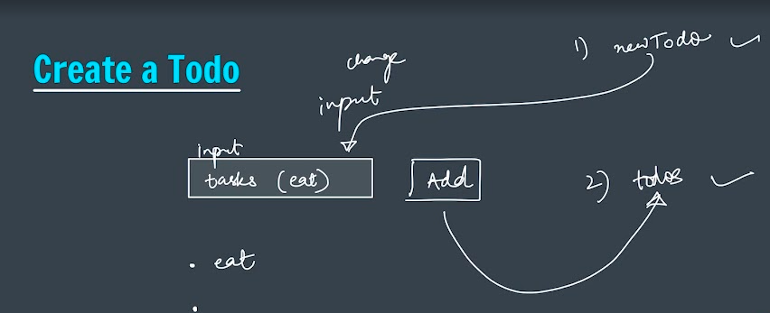
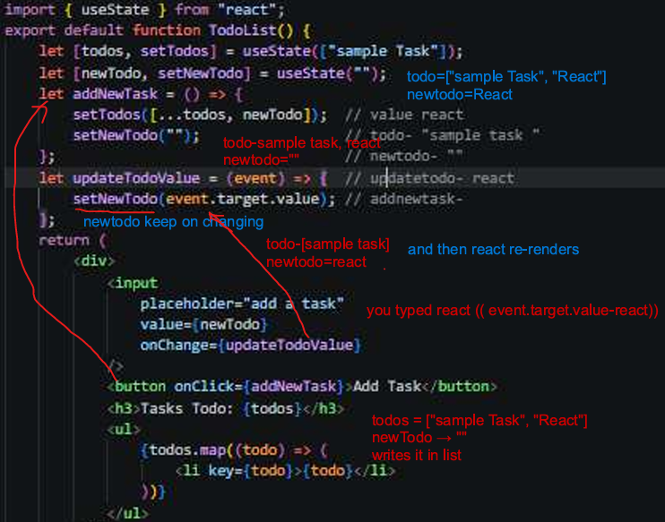
-----------------------
uuid package gives unique id 
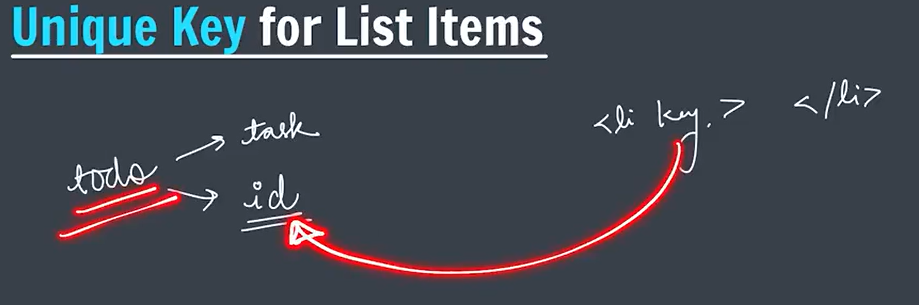
 # deleting from array 
 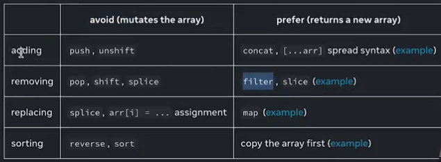
 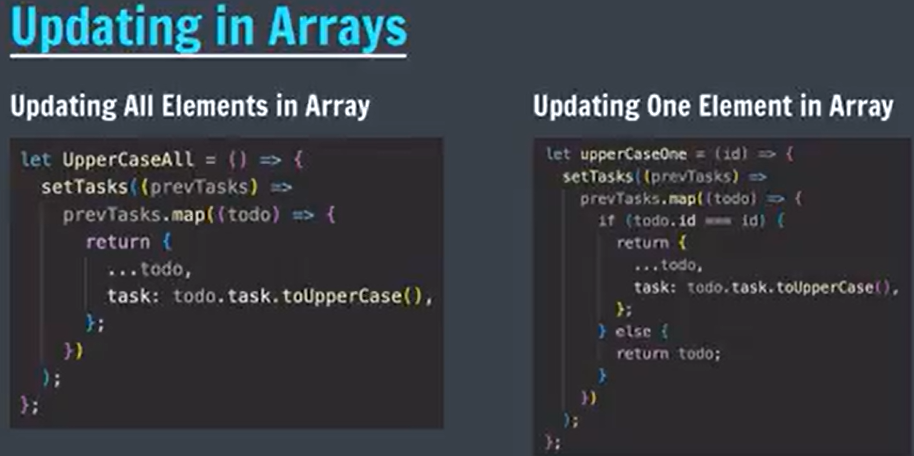


Deployment: render, netlify, cyclic

 16. Interview Questions & Quick Answers
Question
Answer
What is React?
A JavaScript library for building user interfaces using reusable components.
What is JSX?
A syntax extension that lets you write HTML-like markup inside JavaScript. It is compiled into React.createElement calls.
What is a component?
A reusable, independent function that returns JSX. Names start with a capital letter.
What is a Fragment and why use it?
<></> groups elements without adding an extra DOM node.
What are props?
Read-only data passed from a parent to a child component. They are immutable.
Difference between props and state?
Props are passed in from outside and are read-only. State is owned by the component and can change, which triggers a re-render.
Why is the key prop needed in lists?
It gives each item a stable identity so React can efficiently update, add or remove items.
Why is preventDefault used in forms?
To stop the browser's default submit behaviour, which reloads the page.
What is useState?
A hook that adds a state variable to a function component. It returns the current value and a setter.
Why not use a normal variable instead of state?
It resets on every render, and changing it does not trigger a re-render.
When do you use the callback form of a setter?
When the new state depends on the previous state, e.g. setCount(c => c + 1).
Why does mutating an array or object state not update the UI?
The reference stays the same, so React thinks nothing changed. Create a new copy instead.
What are the rules of hooks?
Call hooks only inside function components (or custom hooks), and only at the top level.
Difference between `onClick={fn}` and `onClick={fn()}`?
The first passes a reference to run on click. The second runs immediately during render.
What is lazy initialization in useState?
Passing a function (useState(() => init())) so the expensive initial value is computed only on the first render.
What is a closure?
An inner function that remembers variables from its outer scope even after the outer function has finished.

17. One-Page Cheat Sheet
Topic
Remember
Component
Function, capital letter, returns one root element
JSX
Close all tags, camelCase, className, {} for JavaScript
Props
Read-only, {3000} is a number, default values via price = 1
Lists
.map() + unique key
Conditions
cond ? A : B or cond && A
Styling
style={{ backgroundColor: "red" }} or a CSS file per component
Events
Pass reference: onClick={fn}. Use e.preventDefault() on forms
State
useState. Re-renders only when the value changes
Depends on old state
setX(prev => ...)
Objects / arrays
Never mutate. Copy with spread, map, filter
Hooks
Only in function components, top level only


