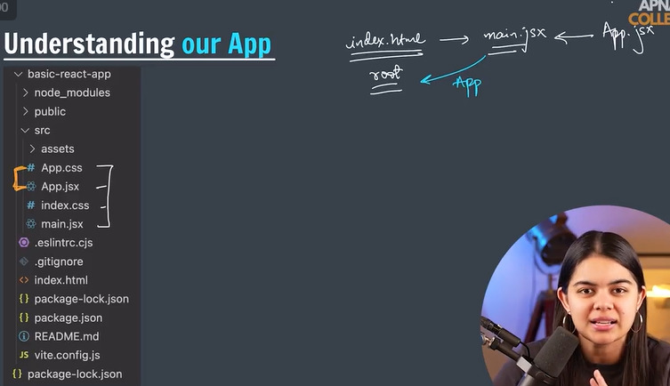
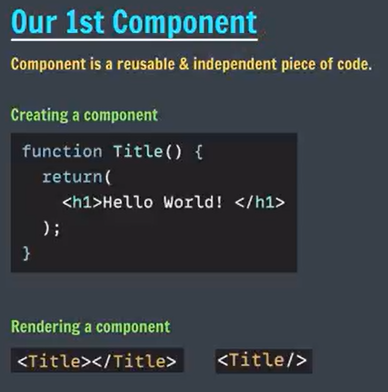
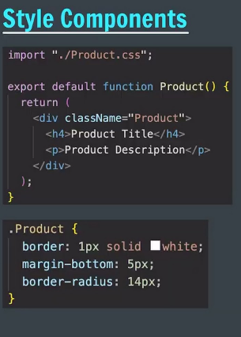

 
 

node-modules: has all the node dependencies 
public: svg file 

imp src folder
assets: react svg image 

app.css:
app.jsx: app is our component 
index.css
main.jsx:

app.jsx has our component and inside it there will be other sub components
component will have html css js

js, html- app.jsx
css -app.css

single app component - app.js+app.css
--------------------------------------------------------------------------
index.html is the main page  
------------------------------------------------------------------------
main.jsx usually import 

conclusion 
index.html has root id and script file was main.jsx
main.jsx will access root element and root element is accessed and rendered. app  component is  coming from app.jsx 

app.jsx has count  returns/exported to main.jsx

the homepage is created from app.jsx 
the whole page is a component in itself 

index.html/ treads main -> root component

3 main file 
index.html, main.jsx and app.jsx
app styling- app.css
index.html - index.css

all changes are done in app.jsx

title function will have its own app.jsx file 
In React, component names must start with an uppercase letter.

1. Return a single root element; 
to return multiple elemtns from a component, wrapt them with a single parent tag like div

2. Close all the tags 
3. camelCase on most of the things 
- capital for naming components 
- cannot use reserved keuwords

FRAGMENT-  small part
you normally write div which creates extra node, if you don't want to make extra node
<></>

jsx with curly braces helps us to write pure js 

Product component 
helps with reusability 

each file will have separate css file industry standards 

web pack allows you with import and export property 

