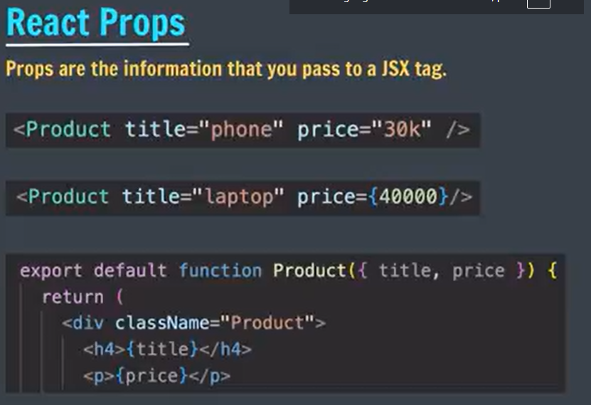

### Rendering is a process where computer uses instructions to generate output/ webpage on screen

 
 

node_modules/	Installed npm dependencies.
public/	svg img of vite
src/	Main application source code.
src/assets/	svg img of react

The complete flow

Imagine you have:
<!-- 
index.html

main.jsx
createRoot(document.getElementById("root")).render(<App />);

App.jsx
"
function App() {
  return (
    

      <h1>Hello World</h1>
      <Title />
    

  );
}
" -->
The flow is:

        index.html
            │
            │
            ▼
    

            │
            │  main.jsx finds #root
            ▼
       React starts
            │
            │  render(<App />)
            ▼
          App
            │
            ├── <h1>Hello World</h1>
            │
            └── <Title />
                    │
                    ▼
                 Title

3 main file 
index.html, main.jsx and app.jsx
app styling- app.css
index.html - index.css

all changes are done in app.jsx

title function will have its own app.jsx file 
In React, component names must start with an uppercase letter.

1. Return a single root element; 
to return multiple elemtns from a component, wrapt them with a single parent tag like div

2. Close all the tags 
3. camelCase on most of the things 
- capital for naming components 
- cannot use reserved keuwords

<></>

jsx with curly braces helps us to write pure js 

each file will have separate css file industry standards 

--------------------------
  

"3000"->string
{3000}-> number
default value Produce.({title, priced=1})
if price is not there default price will 1 

--------------------------------------
 
 # React: Rendering Arrays Using .map()
1. What is .map()?

.map() is a JavaScript array method used to go through every item in an array and create a new result from each item.

2. Basic Syntax
array.map((item) => {
    return something;
});

In React, we commonly use it to create JSX elements:

array.map((item) => (
    <li>{item}</li>
))
3. Example
let features = ["hi-tech", "durable", "fast"];

features.map((feature) => (
    <li key={feature}>{feature}</li>
));

.map() runs for every item:

"hi-tech"  →  <li>hi-tech</li>
"durable"  →  <li>durable</li>
"fast"     →  <li>fast</li>
--------------------

camelCase for styling: backgroundColor

=============================
DYNAMICE styling component 
